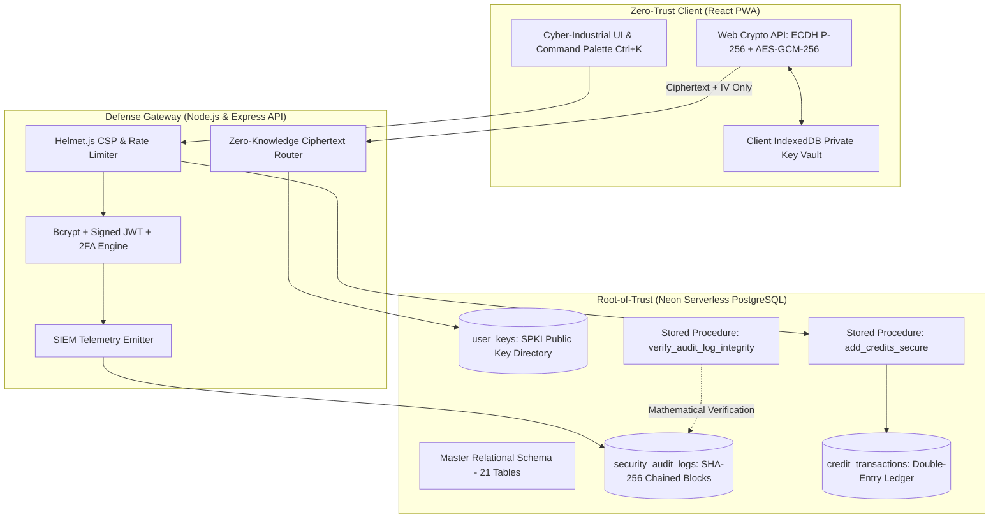

# 🔮 Drishti (दृष्टि) — Cyber-Hardened Creator Platform

> **Status:** `v0.9.0-beta` | **Security Posture:** Zero-Trust Architecture | **Database:** Neon Serverless PostgreSQL

[](#security-architecture)
[](#cryptographic-engine)
[](#tamper-evident-audit-ledger)
[](https://neon.tech)
[](LICENSE)

Drishti (दृष्टि — *Vision*) is an enterprise-grade creator and media streaming platform built from the ground up with a **security-first, zero-trust philosophy**. 

Instead of relying on perimeter security or client-side trust, Drishti incorporates **browser-native End-to-End Encryption (E2EE)**, **tamper-evident SHA-256 audit ledgers**, **server-authoritative double-entry balance accounting**, and an interactive **Security Operations Center (SOC)** dashboard.

---

## 🏛️ System Architecture



---

## 🔐 Core Security & Cryptographic Specifications

| Security Primitive | Implementation Standard | Threat Mitigated |
| :--- | :--- | :--- |
| **E2EE Key Agreement** | NIST Curve P-256 (secp256r1) ECDH | Man-in-the-Middle (MitM), Passive Wiretapping |
| **Message Encryption** | AES-256-GCM (Authenticated Encryption) | Ciphertext Tampering, Bit-Flipping, Replay Attacks |
| **Key Storage** | Browser-Isolated IndexedDB Key Vault | Database Host Compromise, Plaintext Leakage |
| **Audit Ledger Integrity** | SHA-256 Hash Chained Linked Blocks | SQL Injection Tampering, Rogue DB Admin Alterations |
| **Balance Accounting** | Pessimistic Locking (`FOR UPDATE`) + Stored Procedures | Concurrency Race Conditions, Balance Underflow |
| **Multi-Factor Auth (MFA)** | RFC 6238 TOTP with AES-256-GCM Envelope Encryption | Credential Stuffing, Database Dump Exposure |
| **Emergency Recovery** | Salted SHA-256 Hashing with Single-Use Burn | Offline Brute-Force of Account Recovery Codes |
| **Privilege Control** | Stored Procedure & Trigger Constraint Enforcement | Client-Side Privilege Escalation (`is_admin`, `credits`) |

---

## ⚡ Quick Start & Verification

### Prerequisites
- Node.js v18+ (tested on v20 & v24)
- Neon Serverless PostgreSQL instance

### 1. Installation
```bash
# Clone the repository
git clone https://github.com/your-username/drishti.git
cd drishti

# Install backend dependencies
cd backend && npm install

# Install frontend dependencies
cd ../frontend && npm install
cd ..
```

### 2. Environment Setup
```bash
# Configure backend environment
cp backend/.env.example backend/.env
# Edit backend/.env with your Neon DATABASE_URL and JWT_SECRET

# Configure frontend environment
cp frontend/.env.example frontend/.env.local
```

### 3. Run Automated 5-Phase Security Verification
Execute the automated test suite verifying all cryptographic invariants, stored procedures, and audit chains live against Neon:
```bash
node backend/tests/verify_all_phases.js
```

### 4. Launch Development Environment
```bash
# Windows
.\start.bat

# Or run manually in separate terminals:
# Terminal 1 (Backend API):
cd backend && npm run dev

# Terminal 2 (Frontend Client):
cd frontend && npm run dev
```

---

## 🛡️ Security Operations Center (SOC) Preview

Drishti features an administrative SOC dashboard providing real-time visibility into the cryptographic state of the application:
* **1-Click Audit Verification:** Calls `verify_audit_log_integrity()` to mathematically verify every historical SHA-256 chained block from the Genesis Block to current head.
* **Live SIEM Feed:** Surfaces authentication events, 2FA recovery code burn events, and financial mutations with actor UUID and IP attribution.
* **Global Cyber CLI:** Press `Ctrl+K` (or `Cmd+K`) anywhere in the application to access the command palette.

---

## 📚 Documentation & Research Artifacts

- [STRIDE Threat Model & Security Whitepaper](docs/security_whitepaper.md)
- [Resume Bullet Points & AppSec Interview Guide](docs/resume_bullet_points.md)
- [System Architecture Specification](docs/architecture.md)

---

## 📜 License
MIT License. Created by Vagish for academic and cybersecurity engineering portfolio demonstration.
