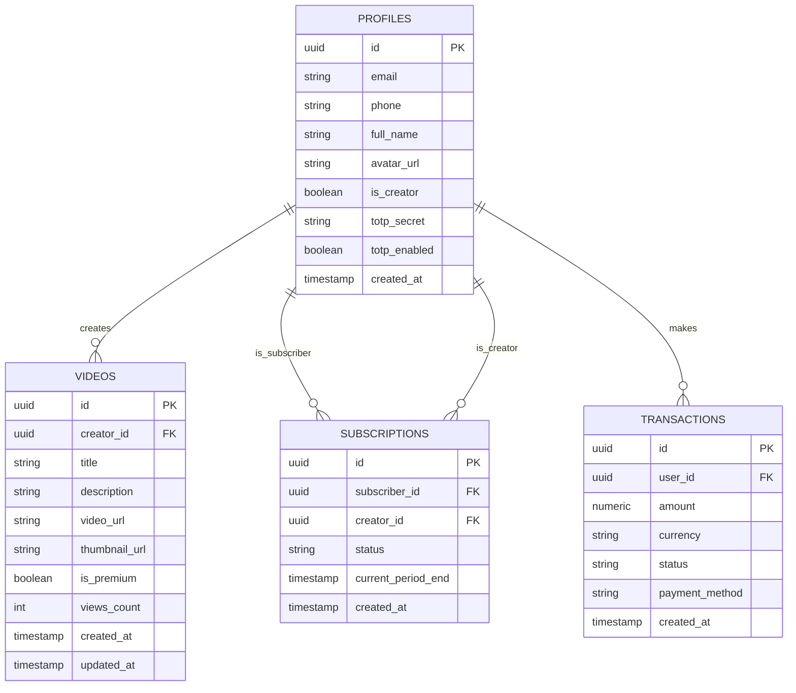

# Drishti: Architectural Overview

## Project Vision
Drishti (दृष्टि) is a research-grade full-stack Progressive Web Application (PWA) designed to give independent creators—specifically in emerging markets—a lightweight, self-hostable platform. Central to this platform is an in-app video recording and hosting workflow, gated behind a sophisticated subscription access control mechanism ensuring sustainable monetization without reliance on exorbitant vendor locking.

## Architecture & Modules

### 1. Database & Security Layer (Supabase)
The backbone of Drishti is built on PostgreSQL hosted via Supabase. It maintains `profiles`, `videos`, `subscriptions`, and `transactions`.
All data interaction is fiercely protected by generic and specific Row Level Security (RLS) policies:
- User data isolation ensures creators and users only view and update their own profiles or assets.
- Premium visibility gates non-subscribed users automatically at the database level using subqueries referencing active `subscriptions` records.

### 2. Backend & Authentication (FastAPI)
- Uses asynchronous endpoints allowing high throughput and scale.
- Supabase Auth integration supports One-Time Password (OTP) via email/phone, combined with TOTP (RFC 6238 Standard) for Two-Factor Authentication (2FA).
- JWT architecture focuses on short-lived 15-minute access tokens and strict `httpOnly` refresh token rotation. Pydantic performs validation at the edge.

### 3. Progressive Web Application (React + Vite)
- Delivers a cinematic, dark-premium aesthetic via Framer Motion sequences and custom Tailwind properties matching the `Drishti` color palette.
- Offline readiness and installability mapped heavily via PWA configuration (`manifest.json` and service worker).
- Media capture leverages the native `MediaRecorder API` for drag-and-drop or direct client-side recording before uploading securely to Supabase Storage.

### 4. Subscription & Transactions (Simulated Payment Gateway)
Drishti adopts a pluggable architecture. The "Simulated Payment Gateway Module" represents a modular domain modeling realistic subscription lifecycles, and behaves seamlessly like industry heavyweights (Stripe, Razorpay). It strictly processes test card parameters while allowing drop-in upgrades for real production networks in the future.

---

## Entity Relationship Diagram (ERD)

