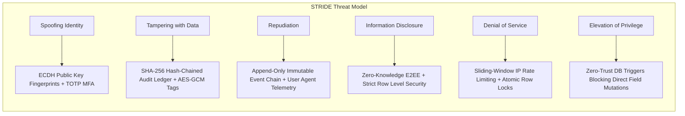

# Drishti (दृष्टि) — Security Architecture & Threat Model (STRIDE)

## 1. System Classification & Executive Overview
**Drishti** is a Zero-Trust, End-to-End Encrypted (E2EE) creator and media streaming platform. Unlike conventional consumer applications that trust client-side state or store direct communications in cleartext on central databases, Drishti enforces cryptographic isolation, server-authoritative double-entry ledgers, and tamper-evident audit trails.

---

## 2. Core Cryptographic Primitives & Specifications

| Security Domain | Primitive / Algorithm | Specification & Key Size | Threat Mitigated |
| :--- | :--- | :--- | :--- |
| **Key Agreement (E2EE)** | ECDH (Elliptic Curve Diffie-Hellman) | NIST Curve P-256 (secp256r1) | Man-in-the-Middle (MitM), Passive Eavesdropping |
| **Content Encryption (E2EE)** | AES-GCM (Authenticated Encryption) | 256-bit symmetric key, 96-bit unique IV/nonce | Ciphertext Tampering, Replay Attacks |
| **Audit Ledger Integrity** | Cryptographic Hash Chaining | SHA-256 with serial state coupling | Database Tampering, Rogue DB Admin Escalation |
| **Identity Verification** | Out-of-band Key Fingerprints | SHA-256 Digest formatted in Hex (`XX:XX:...`) | Identity Spoofing, Key Substitution |
| **MFA at Rest** | AES-256-GCM Envelope Encryption | Master Key derived with SHA-256 PBKDF | Database Dump Exfiltration of TOTP Secrets |
| **Recovery Codes** | SHA-256 Cryptographic Hash with Salt | 8-character single-use tokens | Offline Brute-force of Emergency Codes |

---

## 3. STRIDE Threat Model Analysis

### 3.1 Spoofing (Identity)
*   **Threat:** Adversary generates arbitrary session tokens or mimics creator identity.
*   **Mitigation:** 
    *   Supabase Auth JWT tokens combined with httpOnly SameSite refresh cookies.
    *   TOTP MFA (RFC 6238) with secrets encrypted at rest.
    *   Public keys bound to unique user UUIDs with SHA-256 cryptographic fingerprints displayed in the UI.

### 3.2 Tampering
*   **Threat A (Client-Side Credit Mutation):** Attacker calls `UPDATE users SET credits = 9999999` from browser console.
    *   *Mitigation:* PostgreSQL `BEFORE UPDATE` trigger (`protect_critical_user_fields`) rejects any client attempt to modify `credits`, `is_admin`, or `is_verified`, throwing a hard security exception. Balance updates are strictly permitted via `SECURITY DEFINER` atomic procedures.
*   **Threat B (Database Record Alteration):** Rogue insider or compromised SQL credentials modifies historical transaction records.
    *   *Mitigation:* `security_audit_logs` uses cryptographic hash chaining: `Hash_n = SHA256(Hash_{n-1} || ID_n || Event || Actor || Timestamp || Details)`. Modifying any historical row invalidates all subsequent hashes, immediately flagged by `verify_audit_log_integrity()`.

### 3.3 Repudiation
*   **Threat:** Administrator or user denies executing a financial transfer or resolving a moderation report.
*   **Mitigation:** Append-only audit logging recording client IP, User-Agent, actor UUID, timestamp, and serial state in the hash chain.

### 3.4 Information Disclosure
*   **Threat:** Compromised database host or unauthorized SQL access reads private conversations between users.
*   **Mitigation:** Direct messages are stored solely as `ciphertext` and `iv`. The decryption keys never touch the network and reside exclusively in client-side `IndexedDB` key vaults.

### 3.5 Denial of Service (DoS)
*   **Threat:** High-volume automated brute-force attacks against authentication endpoints.
*   **Mitigation:** IP-based sliding-window rate limiters (20 req/min for auth, 100 req/min general) coupled with PostgreSQL pessimistic row-level locking (`FOR UPDATE`) to defeat race conditions.

### 3.6 Elevation of Privilege
*   **Threat:** Regular viewer account escalates itself to platform administrator (`is_admin = true`).
*   **Mitigation:** Dual-layer enforcement:
    1.  PostgreSQL trigger level: blocks direct update.
    2.  Application level: `requireAdmin` middleware queries the service role client and verifies database flag before granting access to `/api/admin/*`.

---

## 4. Security Operations Center (SOC) Architecture
The Drishti Admin Panel includes a dedicated SOC interface that continuously polls and visualizes:
1.  **Hash Chain Integrity Verifier:** Mathematically audits every sequential record from the Genesis Root (`GENESIS_ROOT_DRISHTI_SECURITY_CHAIN_2026`) to the current chain head.
2.  **Live Threat Telemetry Feed:** Real-time visibility into authentication failures, privilege elevations, and abnormal balance transfers.
3.  **Defensive Posture Matrix:** Visual status indicators verifying RLS trigger enforcement, E2EE engine health, and cryptographic storage standards.
